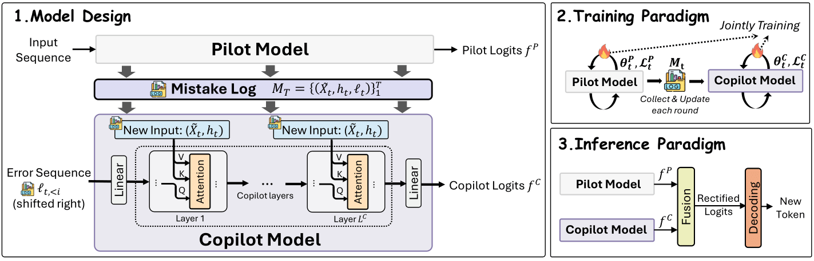
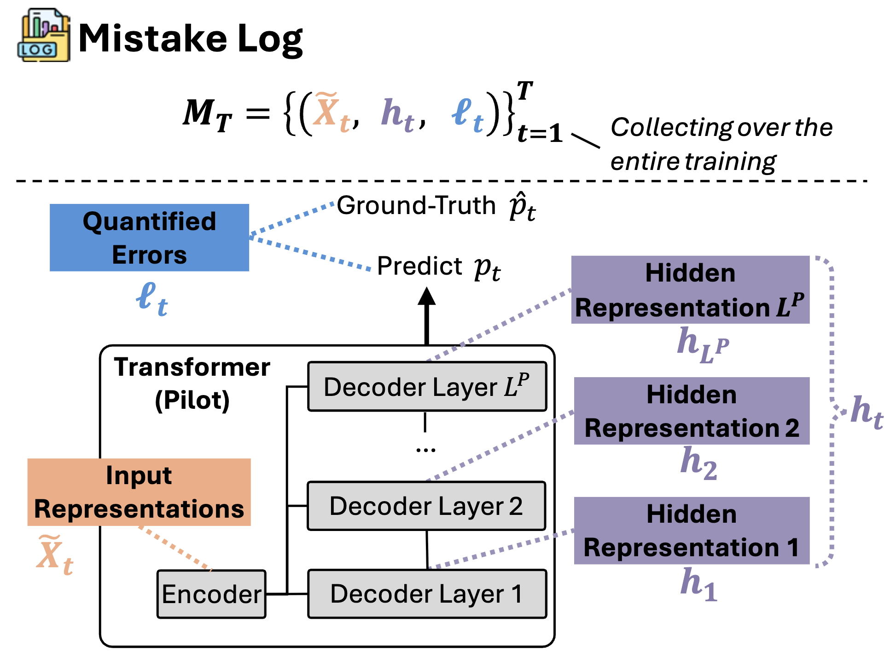
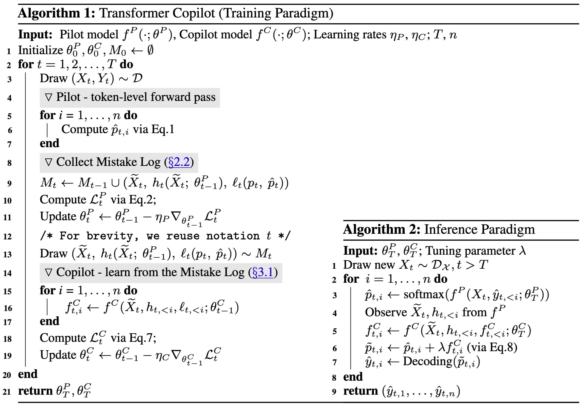
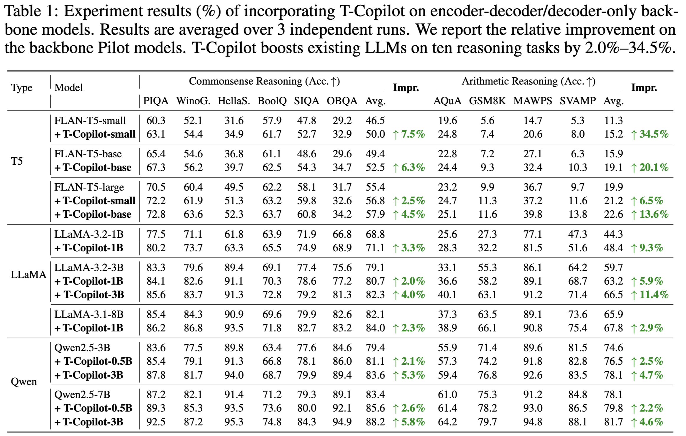
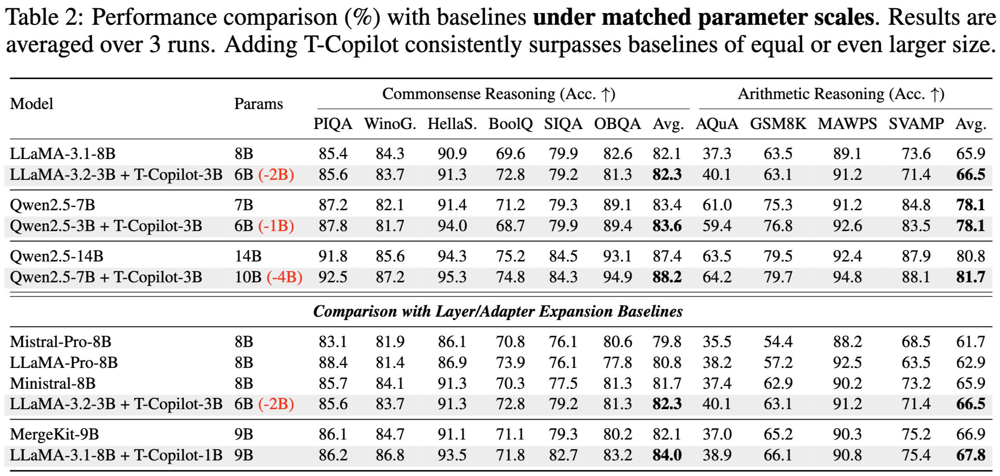
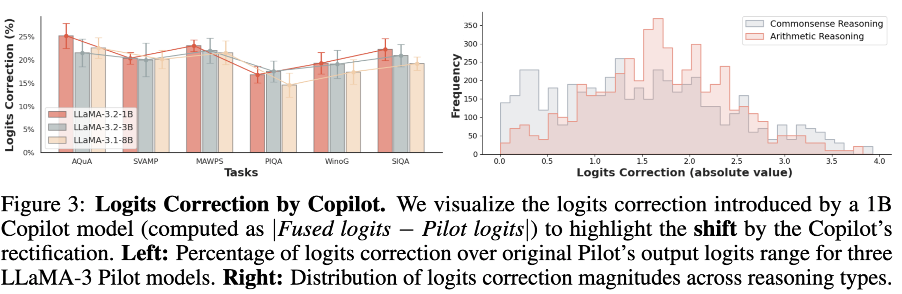
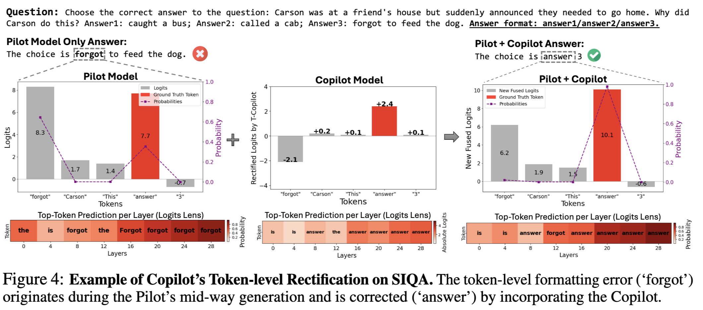
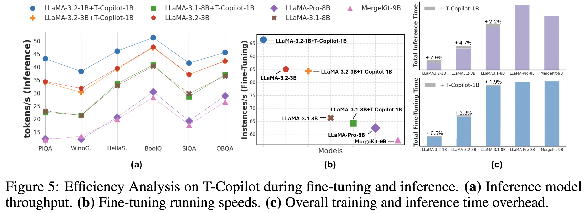

# Transformer Copilot: Learning from The Mistake Log in LLM Fine-tuning



[](https://www.arxiv.org/pdf/2505.16270) &nbsp;&nbsp;


## 📖 **Introduction**
We introduce a novel Pilot-Copilot learning framework, named Transformer Copilot, that learns from a language model's "mistake log" during fine-tuning. By leveraging the Pilot model's learning signals, the Copilot model rectifies the Pilot model's output logits at inference time to improve generation accuracy. Our approach achieves notable gains on challenging reasoning tasks and downstream applications while preserving strong transferability and scalibility.

## 🔥 **News**
[5/26/25] We've realeased our [paper](https://www.arxiv.org/pdf/2505.16270) on arXiv. Our code will be soon updated. Stay Tuned!

## 🚀 **Key Features**

### 🧾 Mistake Log 

We first introduces the *Mistake Log*, a structured log recording the "memory" of Pilot model's training-time behavior. It includes three components:
- **Input Representations $\widetilde{X}$**: Contextual token encodings for the inputs.
- **Internal Rationales $h$**: Layer-wise hidden states from the Pilot model.

- **Discrepency Sequences (Mistakes) $\ell$**: Token-Level discrepancy signals quantifying the Pilot model's prediction error.

  

> The Mistake Log captures model-internal "reflection" and enables informed rectification at inference time.


---
### 🧠 Pilot-Copilot Framework

- **Pilot Model**: A Transformer (e.g., FLAN-T5, LLaMA, Qwen) trained via supervised fine-tuning (SFT)
- **Copilot Model**:
  - A transduction neural network built upon the Pilot’s decoder module
  - Receives Mistake Log as input
  - Learns to predict error patterns and provide **logits corrections**
- **Logits Fusion**: Combines Pilot and Copilot logits for better next-token predictions

---
### 🔮 New Training and Inference Paradigm

#### **Training Paradigm**
- Pilot model minimizes cross-entropy loss on token prediction
- Mistake Log is updated each round with updated contextual and internal representations
- Copilot model learns from the Mistake Log and minimizes RMSE on logits rectification

#### **Inference Paradigm**
- At each step, the Pilot model generates token logits as usual
- The Copilot model then rectify the Pilot's logits prediction
- The final logits are fused together for decoding and next-token generation



> The whole generation process repeats auto-regressively and the Copilot model is able to actively refine the Pilot model's generation without retraining or modifying the original model.

## 📊 Evaluation
T-Copilot is evaluated across 12 diverse benchmarks:

- Commonsense Reasoning: PIQA, HellaSwag, WinoGrande, BoolQ, SIQA, OBQA

- Arithmetic Reasoning: GSM8K, SVAMP, AQuA, MAWPS

- Recommendation: Beauty, LastFM

### 📈 Performance Evaluation
- 2.2%-34.5% accuracy gain on the original Pilot models accross differnt tasks and backbone model tyles


- Outperforms stronger LLMs:
  - `Qwen2.5-7B + T-Copilot-3B` > `Qwen2.5-14B`
  - `Qwen2.5-3B + T-Copilot-3B` > `Qwen2.5-7B`
  - `LLaMA-3.2-3B + T-Copilot-3B` > `LLaMA-3.1-8B`

  

---
### 🔍 Analyses on Logits Rectification
- Logits Correction by Copilot across differnt models and task categories.

- An illustrated example for the logits rectification process by the Copilot model. 


---

### ⚙️ Efficiency, Transferability & Scalability

- **Training overhead**: marginal ~4% extra overall runtime compred to the original Pilot model, outperform other layer adaptation baselines.
- **Inference throughput**: Comparable to baseline Pilot models.


- **Transferability**: One Copilot can be directly generalize across similar Pilot models without additional training.
- **Scalability**: Applicable across T5, FLAN-T5, LLaMA, Qwen, and other transformer architectures.


## **Citation**
```
@misc{zou2025transformer,
  title        = {Transformer Copilot: Learning from The Mistake Log in LLM Fine-tuning},
  author       = {Jiaru Zou and Yikun Ban and Zihao Li and Yunzhe Qi and Ruizhong Qiu and Ling Yang and Jingrui He},
  year         = {2025},
  month        = {May},
  eprint       = {2505.16270},
  archivePrefix= {arXiv},
  primaryClass = {cs.CL},
  url          = {https://arxiv.org/abs/2505.16270},
  doi          = {10.48550/arXiv.2505.16270}
}
```

Please contact *jiaruz2@illinois.edu* if you have any questions!